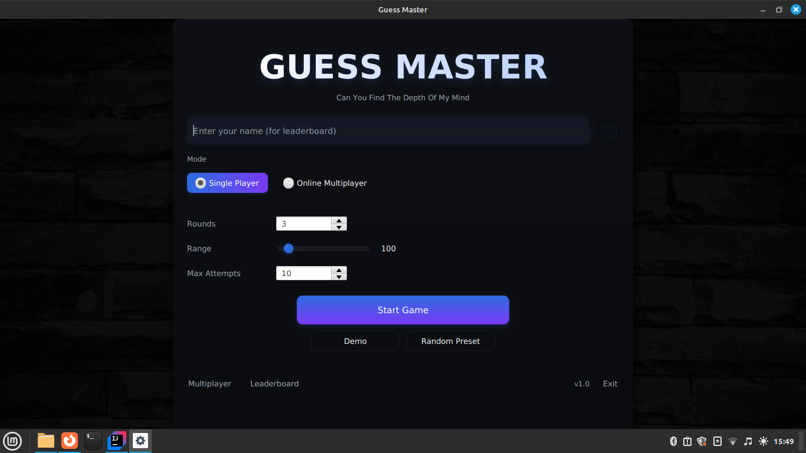

# Guess Master — Desktop Number Guessing Game 🎯

**A polished, modern JavaFX desktop game.**
Guess Master is a small-but-complete desktop project that demonstrates clean UI design, stateful game logic, score/leaderboard persistence, and extendable architecture for multiplayer and online features.

---

## 🎮 Quick demo (Project Images)

> 

---

## 🔥 Project highlights

* Modern, professional desktop UI built with **JavaFX** (FXML + CSS).
* Smooth UX: modal overlays, animations, focused keyboard flow.
* Gameplay features: single-player, configurable rounds, attempt limits, scoring.
* Leaderboard with search & CSV export.
* Clean separation: `controllers`, `services`, `config`, `utils`.
* Easily packaged for distribution (Maven + JavaFX plugin).

---

## 🚀 Features (user-facing)

* **Single Player** — Guess the hidden number, hints of higher/lower, attempts limited.
* **Online Multiplayer** — Players can connect through web sockets.
* **Leaderboard** — Top scores, filtering (all time / 7d / 1d), search, export CSV.
* **Scoring system** — Base points + difficulty multiplier + speed & accuracy bonuses.
* **Post-round dialog** — Modal overlay with round summary, breakdown of points, next/replay/menu options.
* **Polished UI** — Card surfaces, gradients, subtle shadows, consistent typography, keyboard navigation.

---

## 🧱 Project structure

```
guess-master/
├─ pom.xml
├─ src/
│  ├─ main/
│  │  ├─ java/com/guessing/gamemaster/
│  │  │  ├─ GuessMasterApp.java        # launcher
│  │  │  ├─ controllers/               # UI controllers (FXML)
│  │  │  ├─ services/                  # GameService, LeaderboardService
│  │  │  ├─ utils/                     # helpers, SceneManager
│  │  │  └─ config/                    # DB init
│  │  └─ resources/com/guessing/gamemaster/
│  │     ├─ ui/                        # all FXML screens / dialogs
│  │     ├─ styles/                    # CSS files
│  │     └─ images/                    # icons
└─ docs/
   └─ ui-mockups/
```

---

## 🧰 Tech stack & tools

* **Language:** Java (11+ recommended; project works with Java 17 LTS and newer).
* **UI:** JavaFX (FXML + CSS).
* **Build:** Maven (with `javafx-maven-plugin` for `mvn javafx:run`).
* **Persistence:** small embedded store (H2-database).
* **IDE:** IntelliJ IDEA (Scene Builder for FXML visual editing).

---

## ✅ Prerequisites

* JDK 17 (or later) installed and `JAVA_HOME` set.
* Maven (if using the provided `pom.xml`).
* JavaFX SDK version matching runtime (if not using the Maven artifacts) — prefer the Maven `org.openjfx` dependencies to avoid manual module-path handling.

---

## 🛠️ How to run (developer)

### Run with Maven

```bash
# Run the app (development)
mvn clean javafx:run
```

### Build a packaged JAR

```bash
mvn clean package
# If packaging to an executable JAR, follow plugin instructions to include JavaFX mods
```

### Run the JAR (example)

If you produce an executable JAR that includes a JavaFX runtime (jlink or fat-jar), just:

```bash
java -jar target/guess-master-1.0.jar
```

Otherwise, run with JavaFX module-path (example):

```bash
java --module-path /path/to/javafx-sdk/lib --add-modules javafx.controls,javafx.fxml -jar target/guess-master-1.0.jar
```

---

## 🧩 Running in the IDE (IntelliJ)

* Import as a Maven project.
* Make sure the `javafx-maven-plugin` runs or configure VM options to include the JavaFX SDK:

```
--module-path /path/to/javafx-sdk/lib --add-modules javafx.controls,javafx.fxml
```

* If controllers or FXML fail to load, check `fx:id` matches and resource paths use a leading slash (e.g. `getResource("/com/guessing/gamemaster/fxml/main-view.fxml")`).

---

## 📐 Architecture & design decisions

* **Controller thinness:** Controllers handle UI events and delegate game logic to `GameService`. This enables unit testing of game rules independently.
* **Service layer:** `GameService` encapsulates rounds, random number generation, attempt handling, scoring.
* **Dialog & overlay pattern:** Use `StackPane` root and preload modal dialogs (post-round) as hidden nodes — fast show/hide, simple animations, and consistent styling.
* **Scoring system:** base points + difficulty multiplier + speed & accuracy bonuses. Designed to reward skill and speed.
* **Persistence:** small, local H2 DB. Leaderboard queries use name & date filters.

---

## 🧭 Roadmap / Future improvements

* Online multiplayer (matchmaking & real-time sync).
* Achievements & daily challenges.
* Native installers (jlink / jpackage) for Windows/macOS/Linux.
* Accessibility improvements & localization.

---

## 🧾 License

**MIT License** (simple and permissive).

---

## ✍️ About / Contact

* Developer: Raimi Dikamona Lassissi
* GitHub: `https://github.com/ray-cod/guess-master.git`
* Email: `rdikamona9@gmail.com`
